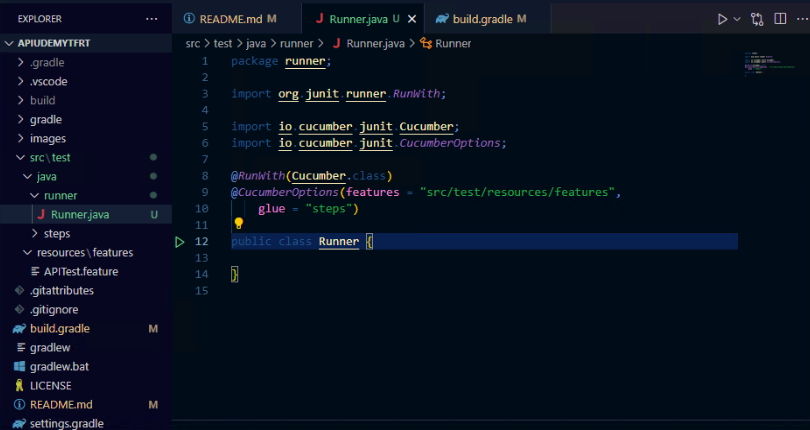

# Curso de : Automation Tester Avanzado: REST Assured, Cucumber y Groovy
https://udemy.com/course/api-test-automation-los-dos-frameworks-esenciales-a-fondo/
# Section 1: Introducción
## Paso 1
Introducción

## Paso 2
### ¿Qué es una API?
Es una interfase, los usuarios son herramientas q requieren hacer pedidos.
es hecha para programas no para seres humanos.

## Paso 3
### ¿Qué es un request?
Es un pedido hecho a un servidor, que estamos esperando como respuesta.

## Paso 4
### ¿Qué es un Response?
Es la respuesta recibida del servidor.

## Paso 5
### ¿Que es un Endpoint?
Es un sitio llamado URI (Universal Recoruce Identifier), algo parecido a a una URL.
Debemos verificar si el sitio existe, y recibimos un 200 (ok) o un error (400 a 509).
Dependiendo de lo pedido vamos a secciones o subsecciones.

## Paso 6
### ¿Qué es API Testing y por qué es tan importante?
Rara vez cambia el API, es mas proclive para hacer pruebas mas estables.


## Paso 7
### El viejo debate: Automation de UI vs. API ¿Cuál hacer y por qué?
Verificar que el botón funciona es con UI.
Si necesito que el usuario está bloqueado sería por API.

# Section 2: Presentando las herramientas que vamos a usar y su configuración.
## Paso 8
### Presentación del VSCode y creación de directorios y proyecto
>[!NOTE]  
>**Requerimientos**
>* [Visual Studio Code](https://code.visualstudio.com/download) 
>* Dentro del VSC las siguiente extensiones:
>
>   * Java Extension Pack, Microsoft
>   * Debugger for Java, Microsoft
>   * code-groovy, Marlon Franca
>   * Cucumber, Cucumber 
>   * Cucumber (Huerking), Alexander Krechik
>   * Gradle for Java, Microsoft
>   * Gradle Laguage Support, Naco Siren

1. Abriendo el VSC totalmente en blanco, a la izquierda al medio
 aparece un botón llamado `Create Java Project`, allí le damos
  click.
2. Seleccionamos en la parte superior al centro, la opción de `Gradle`.
3. Buscamos la ruta donde lo vamos a crear (En mi caso tengo una carpeta 
de "E:\Development\tutorials\java\cucumber\".
4. Crear una carpeta allí como el nombre del proyecto "APIUdemy".
5. Seleccionamos el `DSL` que es `Groovy`.
6. El nombre del proyecto será `APIUdemy`.
7. Sacamos de la carpeta "app" el directorio "src" y el archivo
 **build.gradle** a la raíz del proyecto.
8. La carpeta "app" se puede eliminar. 
9. Dentro de "src/test" verificamos que estén las carpetas:
* "java"
* "resources"
## Paso 09
1. Modificamos el **build.gradle**
```gradle
plugins {
    id 'java'
}

group 'TheFreeRangeTester'
version '1.0.SNAPSHOT'

sourceCompatibility = 1.11

repositories {
    // Use Maven Central for resolving dependencies.
    mavenCentral()
}

dependencies {

}
```
2. Añadimos estas dependencias:
* [REST Assured](https://mvnrepository.com/artifact/io.rest-assured/rest-assured).
* [Cucumber JVM: Java](https://mvnrepository.com/artifact/io.cucumber/cucumber-java).
3. Borramos la carpeta "main", dentro de "scr"
4. Borramos en el archivo **settings.gradle**, la linea de
`include('app')`.
5. Borramos la carpeta "apiudemy" dentro de "src/test/java".
>[!TIP]  
> Muchas veces añadir dependencias requiere que se ejecute la limpieza
> del ambiente de dos maneras:
> * Presionar las teclas [Ctrl][Shift][P], y seleccionar
> `Java: Clean Java Language Server Workspace`, o
> * En el Menú inferior izquierdo, seleccionar `JAVA PROJECT`, 
>luego los puntos suspensivos y ahí está `Clean Workspace`.

## Paso 10
>[!TIP]  
> Ante un mensaje de que si se hace build, le activé el botón de "Always"
>(Siempre) y el creó un archivo en ".vscode" llamado **settings.json**
> con estas líneas:
>```json
>{
>  "java.configuration.updateBuildConfiguration": "automatic"
>}
>```

## Paso 11
> [!IMPORTANT]  
> Las versiones de "Cucumber JVM: Java" y "Cucumber JVM: JUnit 4",
> **TIENEN** que ser iguales.
1. Agrego otra dependencia de [Cucumber JVM: JUnit 4](https://mvnrepository.com/artifact/io.cucumber/cucumber-junit) 
ene el archivo **build.gradle**.
2. Se requiere para los `ExtentReports` añadir en **build.gradle** otra
dependencia [ExtentReports Cucumber7 Adapter](https://mvnrepository.com/artifact/tech.grasshopper/extentreports-cucumber7-adapter).
3. Para el manejo de `json` agregamos otra dependencia en **build.gradle**
[JSON In Java](https://mvnrepository.com/artifact/org.json/json)

>[!TIP]  
> Muchas veces añadir dependencias requiere que se ejecute la limpieza
> del ambiente de dos maneras:
> * Presionar las teclas [Ctrl][Shift][P], y seleccionar
> `Java: Clean Java Language Server Workspace`, o
> * En el Menú inferior izquierdo, seleccionar `JAVA PROJECT`, 
>luego los puntos suspensivos y ahí está `Clean Workspace`.

4. Verificar que se tengan estas rutas o de ser necesario crearlas:
* "src/test/java"
* "src/test/resources/features"
5. Crear el archivo **APITest.feature** dentro de 
"src/test/resources/features", con el siguiente texto:
```feature
Feature: Request example for Udemy

Scenario: Test GET to endpoint.
  Given I send a GET request to the endpoint
  Then I get a list of then users
```

## Paso 12
1. Agrego mas dependencias [Groovy All](https://mvnrepository.com/artifact/org.codehaus.groovy/groovy-all).
2. Otra dependencia para los repoerrtes [JUnit-bom 5 (Bill of Materials)](https://mvnrepository.com/artifact/org.junit/junit-bom).
3. Otra dependencia mas [JUnit Jupiter (Aggregator)](https://mvnrepository.com/artifact/org.junit.jupiter/junit-jupiter).
4. Crear dos carpetas mas:
* "src/test/java/runner".
* "src/test/java/steps".
5. Creamos el archivo **Runner.java** en "src/test/java/runner", con lo 
básico:
```java
package runner;

public class Runner {
  
}
```
>[!IMPORTANT]  
> Las clase **Runner.java**, es la encargada de ejecutar los escenarios o
> los archivos ***.feature**, el la q se encargada de unir las definiciones 
>de los **steps** con los **feature**.

6. Colocamos un `@RunWith` en **Runner.java**, con la herramienta con que
se va a realizar la ejecuciones `(Cucumber.class)` (ojo que no lleva 
punto y coma `;`), por ende se debe importar: 
`import io.cucumber.junit.Cucumber;` e `import org.junit.runner.RunWith;`.
7. Ponemos las `@CucumberOptions` y anexamos una lista de valores:
```java
@CucumberOptions(features = "src/test/resources/features",
    glue = "steps")
```
Así me debe aparecer la clase **Runner.java** con un triángulo o círculo
en la columna izquierda del código (En la imagen es la línea 12):  


