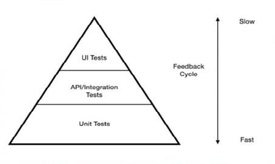

# Curso de : Automation Tester Avanzado: REST Assured, Cucumber y Groovy
https://udemy.com/course/api-test-automation-los-dos-frameworks-esenciales-a-fondo/
# Section 1: Introducción
## Paso 1. Introducción
Introducción

## Paso 2. ¿Qué es una API?
Es una interfase, los usuarios son herramientas q requieren hacer pedidos.
es hecha para programas no para seres humanos.

## Paso 3. ¿Qué es un request?
Es un pedido hecho a un servidor, que estamos esperando como respuesta.

## Paso 4. ¿Qué es un Response?
Es la respuesta recibida del servidor.

## Paso 5. ¿Que es un Endpoint?
Es un sitio llamado URI (Universal Recoruce Identifier), algo parecido a a una URL.
Debemos verificar si el sitio existe, y recibimos un 200 (ok) o un error (400 a 509).
Dependiendo de lo pedido vamos a secciones o subsecciones.

## Paso 6. ¿Qué es API Testing y por qué es tan importante?
Rara vez cambia el API, es mas proclive para hacer pruebas mas estables.


## Paso 7. El viejo debate: Automation de UI vs. API ¿Cuál hacer y por qué?
Verificar que el botón funciona es con UI.
Si necesito que el usuario está bloqueado sería por API.

# Section 2: Presentando las herramientas que vamos a usar y su configuración.
## Paso 8. Presentación del VSCode y creación de directorios y proyecto
>[!NOTE]  
>**Requerimientos**
>* [Visual Studio Code](https://code.visualstudio.com/download) 
>* Dentro del VSC las siguiente extensiones:
>
>   * Java Extension Pack, Microsoft
>   * Debugger for Java, Microsoft
>   * code-groovy, Marlon Franca
>   * Cucumber, Cucumber 
>   * Cucumber (Huerking), Alexander Krechik
>   * Gradle for Java, Microsoft
>   * Gradle Laguage Support, Naco Siren

1. Abriendo el VSC totalmente en blanco, a la izquierda al medio
 aparece un botón llamado `Create Java Project`, allí le damos
  click.
2. Seleccionamos en la parte superior al centro, la opción de `Gradle`.
3. Buscamos la ruta donde lo vamos a crear (En mi caso tengo una carpeta 
de "E:\Development\tutorials\java\cucumber\".
4. Crear una carpeta allí como el nombre del proyecto "APIUdemy".
5. Seleccionamos el `DSL` que es `Groovy`.
6. El nombre del proyecto será `APIUdemy`.
7. Sacamos de la carpeta "app" el directorio "src" y el archivo
 **build.gradle** a la raíz del proyecto.
8. La carpeta "app" se puede eliminar. 
9. Dentro de "src/test" verificamos que estén las carpetas:
* "java"
* "resources"
## Paso 9. Agregando las dependencias clave: Cucumber y Rest Assured.
1. Modificamos el **build.gradle**
```gradle
plugins {
    id 'java'
}

group 'TheFreeRangeTester'
version '1.0.SNAPSHOT'

sourceCompatibility = 1.11

repositories {
    // Use Maven Central for resolving dependencies.
    mavenCentral()
}

dependencies {

}
```
2. Añadimos estas dependencias:
* [REST Assured](https://mvnrepository.com/artifact/io.rest-assured/rest-assured).
* [Cucumber JVM: Java](https://mvnrepository.com/artifact/io.cucumber/cucumber-java).
3. Borramos la carpeta "main", dentro de "scr"
4. Borramos en el archivo **settings.gradle**, la linea de
`include('app')`.
5. Borramos la carpeta "apiudemy" dentro de "src/test/java".
<a name="Tip-Clean-Workspace"></a>

>[!TIP]  
> Muchas veces añadir dependencias requiere que se ejecute la limpieza
> del ambiente de dos maneras:
> * Presionar las teclas [Ctrl][Shift][P], y seleccionar
> `Java: Clean Java Language Server Workspace`, o
> * En el Menú inferior izquierdo, seleccionar `JAVA PROJECT`, 
>luego los puntos suspensivos y ahí está `Clean Workspace`.

## Paso 10. Rest Assured: El estandarte para API testing en Java.
>[!TIP]  
> Ante un mensaje de que si se hace build, le activé el botón de "Always"
>(Siempre) y el creó un archivo en ".vscode" llamado **settings.json**
> con estas líneas:
>```json
>{
>  "java.configuration.updateBuildConfiguration": "automatic"
>}
>```

## Paso 11. Cucumber: Haciendo fácil de entender lo complejo de las APIs.
> [!IMPORTANT]  
> Las versiones de "Cucumber JVM: Java" y "Cucumber JVM: JUnit 4",
> **TIENEN** que ser iguales.
1. Agrego otra dependencia de [Cucumber JVM: JUnit 4](https://mvnrepository.com/artifact/io.cucumber/cucumber-junit) 
ene el archivo **build.gradle**.
2. Se requiere para los `ExtentReports` añadir en **build.gradle** otra
dependencia [ExtentReports Cucumber7 Adapter](https://mvnrepository.com/artifact/tech.grasshopper/extentreports-cucumber7-adapter).
3. Para el manejo de `json` agregamos otra dependencia en **build.gradle**
[JSON In Java](https://mvnrepository.com/artifact/org.json/json)

>[!TIP]  
> [Pasos para Limpiar ambiente luego de añadir dependencias](#Tip-Clean-Workspace).

4. Verificar que se tengan estas rutas o de ser necesario crearlas:
* "src/test/java"
* "src/test/resources/features"
5. Crear el archivo **APITest.feature** dentro de 
"src/test/resources/features", con el siguiente texto:
```feature
Feature: Request example for Udemy

Scenario: Test GET to endpoint.
  Given I send a GET request to the endpoint
  Then I get a list of then users
```

## Paso 12. Clase Runner: Lo necesario para ejecutar nuestros scenarios de Cucumber.
1. Agrego mas dependencias [Groovy All](https://mvnrepository.com/artifact/org.codehaus.groovy/groovy-all).
2. Otra dependencia para los repoerrtes [JUnit-bom 5 (Bill of Materials)](https://mvnrepository.com/artifact/org.junit/junit-bom).
3. Otra dependencia mas [JUnit Jupiter (Aggregator)](https://mvnrepository.com/artifact/org.junit.jupiter/junit-jupiter).
4. Crear dos carpetas mas:
* "src/test/java/runner".
* "src/test/java/steps".
5. Creamos el archivo **Runner.java** en "src/test/java/runner", con lo 
básico:
```java
package runner;

public class Runner {
  
}
```
>[!IMPORTANT]  
> Las clase **Runner.java**, es la encargada de ejecutar los escenarios o
> los archivos ***.feature**, el la q se encargada de unir las definiciones 
>de los **steps** con los **feature**.

6. Colocamos un `@RunWith` en **Runner.java**, con la herramienta con que
se va a realizar la ejecuciones `(Cucumber.class)` (ojo que no lleva 
punto y coma `;`), por ende se debe importar: 
`import io.cucumber.junit.Cucumber;` e `import org.junit.runner.RunWith;`.
7. Ponemos las `@CucumberOptions` y anexamos una lista de valores:
```java
@CucumberOptions(features = "src/test/resources/features",
    glue = "steps")
```
Así me debe aparecer la clase **Runner.java** con un triángulo o círculo
en la columna izquierda del código (En la imagen es la línea 12):  


## Paso 13. Step Definitions en Cucumber: Cómo implementar la lógica.
1. Crear un archivo **APISteps.java** en "src/test/java/steps".
2. Verificamos los pasos y se corrigen de ser necesario en 
**APITest.feature**:
```feature
Feature: Request example for Udemy

Scenario: Test GET to endpoint.
  Given I send a GET request to the endpoint
  Then I get a list with 10 users
```
3. Tomamos del **APITest.feature**, los pasos: `Given` y `Then`, para copiarlos en  **APISteps.java** y les hacemos unos ajustes:
```java
package steps;

public class APISteps {

  @Given ("I send a GET request to the endpoint")
  @Then ("I get a list with 10 users")
  
}
```
4. Colocamos métodos debajo de cada recien `@Given` y `@Then`, mas
las importaciones faltantes:
```java
package steps;

import io.cucumber.java.en.Given;
import io.cucumber.java.en.Then;

public class APISteps {

  @Given ("I send a GET request to the endpoint")
  public void sendGETRequest(){

  }
  @Then ("I get a list with 10 users")
  public void validateListOfUsers(){
    
  }
  
}
```
5. Mejoramos la importación con este: `import io.cucumber.java.en.*;`, 
Los anteriores los podemos borrar o comentar.
6. Los pasos q copiamos de **APITest.feature**, los mejoramos en 
**APISteps.java**, con el _caret_(`^`) y el _signo pesos_(`$`). 
7. el paso del `@Then`, le cambiamos el valor _fijo_ de `10`, por una
expresión regular, y por ende el método debe requerir un argumento:
```java
  @Then("^I get a list with (\\d+) users$")
  public void validateListOfUsers(int expectedUserSize){
    
  }
```
>[!CAUTION]  
> Debo corregir el **build.gradle** en la zona de `dependencies`:
>```gradle
>dependencies {
>    // https://mvnrepository.com/artifact/io.rest-assured/rest-assured
>    testImplementation group: 'io.rest-assured', name: 'rest-assured', version: '5.4.0'
>    // Se requiere una versión "Hermana" de junit igual q la version de cucumber
>    // https://mvnrepository.com/artifact/io.cucumber/cucumber-java
>    implementation group: 'io.cucumber', name: 'cucumber-java', version: '7.16.1'
>    // https://mvnrepository.com/artifact/io.cucumber/cucumber-junit
>    testImplementation group: 'io.cucumber', name: 'cucumber-junit', version: '7.16.1'
>    // https://mvnrepository.com/artifact/tech.grasshopper/extentreports-cucumber7-adapter
>    implementation group: 'tech.grasshopper', name: 'extentreports-cucumber7-adapter', version: '1.14.0'
>    // https://mvnrepository.com/artifact/org.json/json
>    implementation group: 'org.json', name: 'json', version: '20240303'
>    // https://mvnrepository.com/artifact/org.codehaus.groovy/groovy-all
>
>    // https://mvnrepository.com/artifact/org.junit/junit-bom
>    testImplementation (platform('org.junit:junit-bom:5.10.2'))
>    // https://mvnrepository.com/artifact/org.junit.jupiter/junit-jupiter
>    testImplementation ('org.junit.jupiter:junit-jupiter')
>}
>```
> 
> [Pasos para Limpiar ambiente luego de añadir dependencias](#Tip-Clean-Workspace).

8. Desde el **Runner.java**, presionamos el triángulo o círculo en la
zona izquierda del código y esperamos el resultado, algo similar a esto:  


# Section 3: Tipos de request y respuestas.
## Paso 14. Rest Assured: El GET request y sus componentes.

>![NOTE]  
> Aprendiendo la sintaxis de `RestAssured`, importando 
>`import static io.restassured.RestAssured.given;` y usándolo. La 
>Sintaxis es muy similar a la de Cucumber usando el lenguaje 
>[_Gherkin_](https://profile.es/blog/que-es-gherkin/). 
> 
><a name="Thunder-Client-Install"></a>
>
>### Extensión `Thunder Client`
>En el Ejercicio se recomienda instalar la extensión para VSC, llamada
>`Thunder Client` de `thunderclient.com`.
> 1. Luego de instalada, click en el ícono a la izquierda 
>.
>2. Presionar el botón "New Request".
>3. Por defecto el tipo  es `GET`, dejarlo así.
>4. Colocar esto en la URI: `https://api.github.com/users/jdgonzal/repos`.
>5. Presionar el botón `Send`.
>6. Revisar el resultado obtenido.

## Paso 15. Rest Assured: El POST request y sus componentes.

## Paso 16. Rest Assured: El PUT request y sus componentes.

## Paso 17. Rest Assured: El DELETE request y sus componentes.

## Paso 18. Rest Assured: La response y sus componentes.
>[!NOTE]  
> Ejemplo de un JSON q mas adelante podremos estar utilizando:
>```json
>[
>  {
>    "empleado": {
>      "nombre": "Juan",
>      "appelido": "Lopez",
>      "web": "misitio.com"
>    }
>  },
>  {
>    "empleado": {
>      "nombre": "Carlos",
>      "appelido": "Gardel",
>      "web": "miotrositio.com"
>    }
>  }
>]
>```

## Paso 19. Requests REST y SOAP: ¿Cómo se hacen?
>[!TIP]  
> Este es un ejemplo de un request del tipo `SOAP`, usando 
>`RestAssured`:
>```java
>  public void SOAPRequest(){
>    String xmlEnvelope = "<soap12: Envelope xmlns:xsi=\"http://www.w3.org/2001/XMLSchema-instance\" "
>    "xmlns:xsd=\"http://www.w3.org/2001/XMLSchema\" xmlns:soap12=\"http://www.w3.org/2003/05/soap-envelope\">"
>    "<soap12:Body>" +
>    "<Define xmlns=\"http://services.aonaware.com/webservices/\">" +
>    "<word></word>" +
>    "</Define>" +
>    "</soap12:Body>" + 
>    "</soap12:Envelope>";
>
>      given()
>      .header("SOAPAction", "Define")
>      .baseUri("https://api.blogEjemplo.com")
>      .when()
>      .body(xmlEnvelope)
>      .post("/endpoint");
>    }
>```

## Paso 20. Autenticación Básica en Rest Assured: ¿Cómo se hace?
>[!NOTE]  
>Ejemplo de autenticación básica:
>```java
>public void basicAuth (String userName, String password) {
>  given()
>  .auth().basic(userName, password)
>  .when()
>  .get("AUTH_ENDPOΙΝΤ")
>  .then()
>  .assertThat().statusCode(200);
>}
>```

## Paso 21. Autenticación via formulario en Rest Assured: ¿Cómo se hace?
>[!NOTE]  
>Ejemplo de autenticación por formulario:
>```java
>public void formAuth (String userName, String password) {
>  given()
>  .auth().form(userName, password)
>  .when()
>  .get("SERVICE")
>  .then()
>  .assertThat().statusCode(200);
>}
>```

## Paso 22. Autenticación OAuth en Rest Assured: ¿Cómo obtener el Token para autenticar?
>[!NOTE]  
>Obtenemos el permiso de otro servicio q nos va a autenticar para 
>alcanzar la solicitud del request.
>1. Obtener el código del servicio original, para conseguir el 
>`token`.
>2. Obtener el `token`, intercambiando el código q conseguimos.
>3. Acceder al recurso protegido, con nuestro `token`.
>
>Ejemplo de código:
>```java
>public static String clientId = "";
>public static String redirectUri = "";
>public static String scope = "";
>public static String userName = "";
>public static String password = "";
>public static String grantType = "";
>
>public static String encode(String str1, String str2){
>  return new String (Base64getEncoder().encode((str1 + ":" + str2).getBytes()));
>}
>
>// 1. Obtener el código del servicio original, para conseguir el `token`.
>public static Response getCode(){
>  String authorization = encode(userName, password);
>
> return given()
>    .header("authorization", "Basic" + authorization)
>    .contentType(ContenType.URLENC)
>    .formParam("response_type", "code")
>    .queryParam("client_id", clientId)
>    .queryParam("redicrect_uri", redicrectUri)
>    .queryParam("scope", scope)
>    .post("/oauth/authorize")
>    .then()
>    .statusCode(200)
>    .extract()
>    .response();
>}
>
>// 2. Obtener el `token`, intercambiando el código q conseguimos.
>public static String parseForOAuthCode(Response response){
>  return response.jsonPath().getStringh("code")
>}
>
>// 3. Acceder al recurso protegido, con nuestro `token`.
>public static Response getToken(String authCode){
>  String authorization = encode(userNAme, password);
>
>  return given()
>    .header("authorization", "Basic" + authorization)
>    .contentType(ContenType.URLENC)
>    .formParam("response_type", authCode)
>//    .queryParam("client_id", clientId)
>    .queryParam("redicrect_uri", redicrectUri)
>    .queryParam("grant_type", grantType)
>    .post("/oauth/token")
>    .then()
>    .statusCode(200)
>    .extract()
>    .response();
>}
>
>public static String parseForToken(Response loginResponse){
>  return loginResponse.jsonPath().getString("access_token");
>}
>
>```

## Paso 23. Autenticación OAuth: Usando el Token y ahondando en lo que hicimos.
>[!NOTE]  
> Creamos otra función o método mas:
>```java
>// Otra variable mas arriba
>public static String accessToken = "";
>
>public void getFinalService(){
>  given().auth()
>  .oauth2(accessToken)
>  .when()
>  .get("/service")
>  .then()
>  .statusCode(200);
>}
>```
> Una explicación mas detallada:
>* **Response Type**: Es el código de autorización esperado.  
>* **Grant Type**: La manera en q la app esta obteneindo el `token`.
>* **Redirect Uri**: la nueva ruta q nos van a direccionar. Pero acá 
> mas q la ruta es el conseguir el dato a trabajar.
>* El Token se puede pasar como un _Header_, como el siguiente ejemplo:
>```java
>public void getFinalService(){
>  given().auth()
>  .header("Authorization", "Bearer " + accessToken)
>  .when()
>  .get("/service")
>  .then()
>  .statusCode(200);
>}
>```

## Paso 24. Thunder Client: La extensión definitiva para explorar APIs en VSCode.
>[!NOTE]  
> Opciones para entender la extensión:
>* [Thunder Client - Postman dentro de Visual Studio Code](https://www.youtube.com/watch?v=HZx5X3s_Jl4).
>* [Que Es, Como Funciona Thunder Client](https://www.youtube.com/watch?v=Ad14nNSENz4).
>
>[Pasos para la instalación de Thunder Client](#Thunder-Client-Install)

# Section 4: Step Definitions y Rest Assured.

## Paso 25. Definiendo los steps creados.
1. Cambió del texto en **APITest.feature** de 
`Then I get a list with 10 users` a `Then I get a 200 status code`
2. debo cambiar ese mismo texto en **APISteps.java**, dejando algo así:
`@Then("^I get a (\\d+) status code$")`.
3. Definimos una variable `request` de tipo `RequestSpecification`,
por ende importamos `import io.restassured.specification.RequestSpecification;`.
4. Importamos de manera especial lo de `RestAssured`, empezando con el 
`given`, así: `import static io.restassured.RestAssured.given;`.
4. La variable `request`, le cargamos el valor del `given` e importamos
lo faltante `import io.restassured.http.ContentType`:
```java
  @Given("^I send a GET request to the endpoint$")
  public void sendGETRequest() {
    request = given()
              .baseUri("https://api.github.com")
              .contentType(ContentType.JSON);
  }
```
5. Añadimos la variable `response` de tipo `Response` e importamos
`import io.restassured.response.Response;`.
```java
  @Then("^I get a (\\d+) status code$")
  public void validateListOfUsers(int expectedStatusCode) {
    response = request.when()
              .get("/users/jdgonzal/repos");  // Acá va el endpoint
   
    json = response.then().statusCode(expectedStatusCode);
  }
```
6. Definimos la variable `json` de tipo `ValidatableResponse`, e
importamos `import io.restassured.response.ValidatableResponse;`.
7. Ajustamos el **Runer.java** en la parte de `@CucumberOptions`, así:
```java
@CucumberOptions(features = "src/test/resources/features",
    glue = "steps",
    // plugin ={"pretty",
    //   "com.aventstack.extentreports.cucumber.adapter.ExtentCucumberAdapter:",
    //   "timeline:test-output-thread/"},
    tags = "@API"
)
```
8. Podemos correr desde **Runner.java** y vemos el resultado, sin errores.
9. Provoquemos un error cambiando en **APITest.feature** el `200` por el 
`400` y volvemos a correr desde **Runner.java**.

## Paso 26. Estructura de los steps con Rest Assured: Static y Private, ¿por qué?
>[!NOTE]  
> El porque `import static io.restassured.RestAssured.given;` y
>`private static RequestSpecification request;` en el archivo
>**APISteps.java**, así te permite utilizar directamente el `given()`, 
sin crear la instancia, se llama _Método de una clase_.

## Paso 27. Tipos de HTTP Codes y sus significados.
>[!NOTE]  
> Lista de respuestas esperadas :[Respuestas HTTP](https://developer.mozilla.org/es/docs/Web/HTTP/Status).  
>.

## Paso 28. Validar la cantidad de recursos recibidos en el JSON.
1. Cambiamos en **APISteps.java** el `@Given` a esto:
`@Given("^I send a GET request to the (.+) URI$")`.
2. Por ende ya recibimos un argumento en el método `sendGETRequest`, 
de tipo `String`, llamado `URI`.
3. El argumento lo usamos en `.baseUri(URI)`.
4. Y cambiamos el texto enviado en **APITest.feature**, así:  
`Given I send a GET request to the https://api.github.com URI`.
5. Creamos un nuevo `Scenario` en **APITest.feature**:
```feature
Scenario: Validate the quantity of elements in the response. 
  Given I send a GET request to the https://jsonplaceholder.typicode.com URI
  Then I validate there are 10 items on the /users endpoint
```
6. Añadimos en **APISteps.java** el paso faltante del `@Then`, con dos
argumentos, dado q eso leemos del ***.feature**:
```java
  @Then("^I validate there are (\\d+) items on the (.+) endpoint$")
  public void validateSize(int expectedSize, String endpoint) {
}
```
>[!TIP]  
> Los argumentos se **TIENEN** q poner en el orden que está en el 
>texto, en este caso primero el `int` y luego el `String`.

7. Cargamos el `response` y nos llevamos la lista a una  nueva variable
 llamada `jsonResponse` de tipo `List<String>` e importamos 
 `import java.util.List;`:
```java
    response = request.when()
        .get(endpoint);

    List<String> jsonResponse = response.jsonPath().getList("$");
```
8. Llevamos el tamaño o cantidad a una variable de tipo `int` llamada
`actualSize`, de esta manera: `int actualSize = jsonResponse.size();`.
9. Si hacemos la importación de tipo `static`, obtenemos solo la parte
de `AssertEquals` de esta manera: `import static org.junit.Assert.assertEquals;`
, y este sería el método completo:
```java
  @Then("^I validate there are (\\d+) items on the (.+) endpoint$")
  public void validateSize(int expectedSize, String endpoint) {
    response = request.when()
        .get(endpoint);
    // Obtenemos toda la lista del JSON
    List<String> jsonResponse = response.jsonPath().getList("$");
    // Cargamos el valor actual
    int actualSize = jsonResponse.size();
    // Comparamos el valor esperado con el actual
    assertEquals(expectedSize, actualSize);
  }
```
10. Movemos el tag de **APITest.feature** al nuevo `Scenario`.
11. Corremos desde **Runner.java** y vemos el resultado, sin errores.

## Paso 29. Obtener un valor específico del Response.
1. Añadir otro `Scenario` en **APITest,feature**, y le movemos el tag solo 
a este nuevo:
```feature
@API
Scenario: Validate an element exist in the response.
  Given I send a GET request to the https://jsonplaceholder.typicode.com URI
  Then I validate there is a username: Bret in the response at /users endpoint
```
2. Definimos el Step en **APISteps.java**, para el nuevo `@Then`:
```java
  @Then("^I validate there is a (.+): (.+) in the response at (.+) endpoint$")
  public void validateValue(String key, String value, String endpoint) {
    response = request.when()
        .get(endpoint);
    // Obtenemos toda la lista del JSON
    List<String> jsonResponse = response.jsonPath().getList(key);

    assertTrue(jsonResponse.contains(value));
  }
```
>[!TIP]  
> También importamos `import static org.junit.Assert.assertTrue;` en
> **APISteps.java**.

3. Podemos mejorar el `assertTrue` poniendo un mensaje si hay un error
al momento de validar, dejando algo así:
```java
    assertTrue("The " + key + " with value:" + value + " was not found.",
        jsonResponse.contains(value));
```
4. Para probarlos cambiemos en **APITest.feature** esta linea:
`Then I validate there is a username: Bret in the response at /users endpoint`  
por esta otra `Then I validate there is a username: Carlos in the response at /users endpoint`.
5. Podemos correr desde **Runner.java** y vemos el resultado con el error.
6. Coloquemos otro nombre en vez de `Carlos` por `Delphine` en 
**APITest.feature**.
7. Podemos correr desde **Runner.java** y vemos el resultado, sin errores.

## Paso 30. Obtener un valor específico anidado en el Response.
1. Añadimos a **APITest.feature** un nuevo `Scenario` y movemos el tag a 
este nuevo:
```feature
@API
Scenario: Validate a value nested within the response
  Given I send a GET request to the https://jsonplaceholder.typicode.com URI
  Then I validate there is a street: Kattie Turnpike in the response at /users endpoint
```
2. Podemos correr desde **Runner.java** y vemos el resultado con error:  
`java.lang.AssertionError: The street with value:Kattie Turnpike was not found.`
>[!TIP]  
> Hice una prueba cambiando el simple `street` de **APITest.feature** 
>por uno mas complejo como `address.street` y funcionó 😃.

>[!NOTE]  
> La solución propuesta por el instructor no es muy "prolija" (como suele 
>decir él) yes cambiar en **APISteps.java** esto: 
>`List<String> jsonResponse = response.jsonPath().getList(key);` por esto
>`String jsonResponse = response.jsonPath().getString("address.street");`.  
> Prefiero la solución de solo cambiar el dato en **APITest.feature** .

# Section 5: Aplicando lo aprendido con una API real.
## Paso 31. Analizando la documentación de una API.
>[!NOTE]  
>Este es el sitio q propone el instructor para trabajar: 
[RapidApi](https://rapidapi.com/).  
>Pero primero hay q hacer un "Sign in" o "Sign Up":
>1. Como es la primera vez hacemos un "Sign Up" y en mi caso me autentiqué
> usando la cuenta de [GitHub](https://github.com/).  
> 
>2. Pide datos adicionales, para poder continuar:  
>

## Paso 32. Definiendo los scenarios para testear la API en Cucumber
>[!IMPORTANT]  
> la URI propuesta por el instructor [Brave New Coin](https://rapidapi.com/collection/brave-new-coin-api-collection), ya no existe,
>entonces cambié a la de [API de Twitter](https://developer.twitter.com/en/docs/twitter-api), ahí tengo mi cuenta básica de twitter.
>
>1. Ingresé a [Developer Portal](https://developer.twitter.com/en/portal/dashboard)
>2. Adicioné un proyecto.
>3. El Sistema genera una APP.
>4. Vamos al Proyecto y a al opcion de "Settings", para presionar 
>[Edit].
>5. Verificamos que el "Project use" esté en "Doing Academic research".
>6. Regresando a la APP presionamos el botón [Edit] de abajo, es 
>decir de "User autentication settings".
>7. El "App permissions" lo dejamos en "Read and write and Direct message".
>8. Cambiamos el "Type of App" a "Web App, Automated App or Bot".
>9. El cuadro de "App Info" , llenar de esta manera:
>    * "Callback URI": http://127.0.0.1
>    * "Website URL":
>https://developer.twitter.com/en/portal/projects/1648328711593181184/apps/26952311/settings
>10. Presione el botón "Save".
>11. Ahora bien el la parte superior, al centro dale click al 
>tabulador "Key and tokens".
>12. Anota cada clave y si no la sabes o no la tienes, dale clik en "Generate" o "Regenerate".
> * **Consumer Keys**:
>   * API Key
>   * API Key Secret
> * **Authentication Tokens**:
>   * Bearer Token 
>   * Access Token
>   * Access Token Secret
> * **OAuth 2.0 Client ID and Client Secret**:
>   * Client ID
>   * Client Secret
>13. En "Products" al centro a la izquierda, lo expandes y debes
> tener como mínimo el "X API v2".
>14. Estando en el lado o tabulador "Free", mira a q tienes permiso:
> * Apps: 1 environment.
> * Posts: Posts - post up to 1500 Posts per month.
> * Cost: free.
> * **Free features**:
>   * [Manage Tweets](https://developer.twitter.com/en/docs/twitter-api/tweets/manage-tweets/introduction).
>     * POST /2/tweets 
>     * DELETE /2/tweets/:id
>   * [Users lookup](https://developer.twitter.com/en/docs/twitter-api/users/lookup/introduction).
>     * GET /2/users/me
>15. Este es un link para **Exportar** y usar en Postman llamada
>[Twtter API v2](https://www.postman.com/twitter/workspace/twitter-s-public-workspace/collection/9956214-784efcda-ed4c-4491-a4c0-a26470a67400?ctx=documentation).
>16. Este es un reposiotrio [Twitter-API-v2-sample-code](https://github.com/twitterdev/Twitter-API-v2-sample-code)
>para probar con varias herramientas:
> * Java
> * Node.js
> * Python
> * R
> * Ruby
>17. Acá un ejemplo paso a paso para los permisos **OAuth 2.0**:
>[OAuth 2.0 Tokens and Twitter API: Everything You Need to Know](https://medium.com/@abhiruchichaudhari/oauth-2-0-tokens-and-twitter-api-everything-you-need-to-know-bddaf9a7f120).

1. Creamos el archivo **TwitterAPIv2.feature** en 
"src/test/resources/features".
2. El ponemos el tag `@xAPIv2` en **TwitterAPIv2.feature**.
3. Hacemos el cambio de `tags` en **Runner.java**.
4. Escribimos el título: `Feature: Twitter API v2 some scenarios.`.
5. Se establece una regla: 
`Rule: When I send POST request to the endpoint, I receive a token I can use to make further authenticated calls.`
6. Añadimos el primer `Scenario` con lo requerido:
```feature
    Scenario: As a user, I can retrieve a Token when making a valid POST request
      Given I have a valid API Key for the https://api.twitter.com URI
      When I send a POST request with the value body to the /oauth2/token endpoint
      Then I can validate I receive a valid token in the response
``` 
7. Siguiente `Scenario` puede ser negativo:
```feature
    Scenario: As a user, I use and invalid API Key, I get an HTTP Code Status 403
      Given I have an invalid API Key for the https://api.twitter.com URI
      When I send a POST request with the value body to the /oauth2/token endpoint
      Then I receive an HTTP Code Status 403
```
8. Otro `Scenario` negativo podría ser:
```feature
    Scenario: As a user, when I send the POST request witout "grant_type", I get an HTTP Code Status 400
      Given I have an invalid API Key for the https://api.twitter.com URI
      When I send a POST request witout "grant_type" in it's body
      Then I receive an HTTP Code Status 400
```

## Paso 33. Definiendo los steps.
1. Crear el archivo **TwitterAPIv2Steps.java** en la ruta 
"src\test\java\steps".
2. Importamos estos elementos requeridos:
```java
import io.cucumber.java.en.*;
import io.restassured.http.ContentType;
import io.restassured.response.Response;
import io.restassured.response.ValidatableResponse;
import io.restassured.specification.RequestSpecification;
```
3. Definimos una cuantas variables:
```java
  private static RequestSpecification request;
  private Response response;
  private ValidatableResponse json;
```
4. Creamos dos variables en el sistema basados en los datos de 
_Twiter API v2_, para `consumer_key` y `consumer_secret`, los nombres
que voy a usar serán `TwitterAPIv2consumer_key` y
`TwitterAPIv2consumer_secret`.
Pasos para crear las "Variables de Ambiente":
    1. Dar el **New** en la parte de abajo (System variables).
    2. Escribir la Variable y el Valor.
    3. Dar **OK**.
    4. Dar el **OK** final de **`Environment Variables`**.
    5. Y Dar el último **OK** de la ventana de **`System Properties`**.  

5. Cerramos y reabrimos el "Visual Studio Code", y dependiendo de la terminal escribimos el comando:  
    >`Powershell`
    ```powhershell
    $env:TwitterAPIv2consumer_key
    $env:TwitterAPIv2consumer_secret
    ```
    >`Command Prompt`
    ```dos
    echo %TwitterAPIv2consumer_key%
    echo %TwitterAPIv2consumer_secret%
    ```
    >`bash`
    ```bash
    echo $TwitterAPIv2consumer_key
    echo $TwitterAPIv2consumer_secret
    ``` 
6. Utilizamos estas variable en el paso de `@Given`:
```java
  @Given("^I have a valid API Key for the (.+) URI$")
  public void iSetTheRequestPArams(String URI) {
    String username = System.getenv("TwitterAPIv2consumer_key");
    String password = System.getenv("TwitterAPIv2consumer_secret");
    request = given().relaxedHTTPSValidation().auth().preemptive()
        .basic(username, password) // Variables de Ambiente
        .contentType(ContentType.URLENC) // Toca usa este Formato
        .baseUri(URI) // La ruta del URI
        .log().all(); // loguea todo el movimiento `DEBUG CONSOLE`
  }
```
7. Creamos el paso del `@When`:
```java
  @When("^I send a POST request with the value body to the (.+) endpoint$")
  public void sendPOSTResquest(String endpoint) {
    // String requestBody = "{\n" + " \"grant_type\": \"client_credentials\"\n" +
    // "}";
    response = request.when()
        .params("grant_type", "client_credentials")
        // .body(requestBody) // No funciona en el body
        .post(endpoint).prettyPeek();
  }
```
8. Y el paso del `@Then`:
```java
  @Then("^I can validate I receive a valid token in the response$")
  public void valiadateTheToken() {
    response.then().statusCode(200);
  }
```
9. Podemos correr desde **Runner.java** y vemos el resultado y solo
hay un `Scenario` válido, también podemos mira el contenido de 
`DEBUG CONSOLE`.
